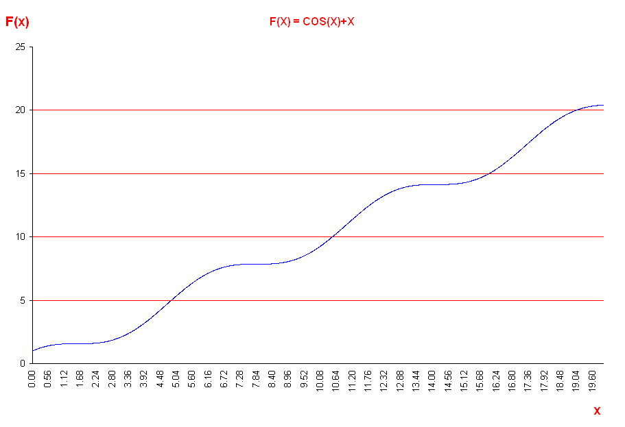



## Equation Graphing \(By VBA\)

### Description

This software draws F(x) for any given defined formula of 'x'. When writing this formula, the rules of writing formulas in MS Excel should be followed.

You can use any pre-defined or user defined functions if its output is numerical.

PLEASE, RATE IT.....
 
### More Info
 

             |
---                |---
**Submitted On**   |2009-06-01 05:20:02
**By**             |[Wael Sayed](https://github.com/Planet-Source-Code/PSCIndex/blob/master/ByAuthor/wael-sayed.md)
**Level**          |Advanced
**User Rating**    |5.0 (10 globes from 2 users)
**Compatibility**  |VBA MS Excel
**Category**       |[Math/ Dates](https://github.com/Planet-Source-Code/PSCIndex/blob/master/ByCategory/math-dates__1-37.md)
**World**          |[Visual Basic](https://github.com/Planet-Source-Code/PSCIndex/blob/master/ByWorld/visual-basic.md)
**Archive File**   |[Equation\_G215383612009\.zip](https://github.com/Planet-Source-Code/wael-sayed-equation-graphing-by-vba__1-72136/archive/master.zip)

